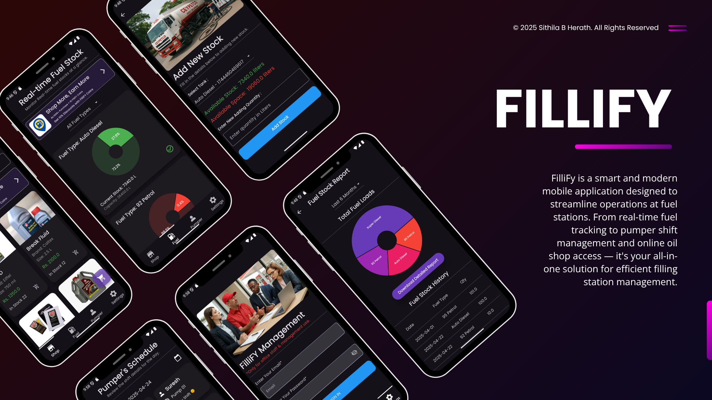
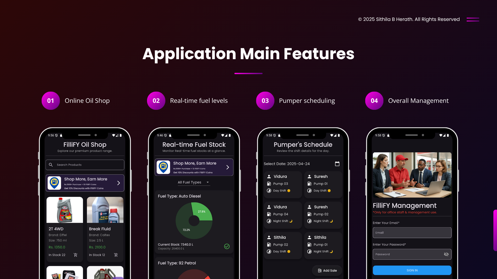
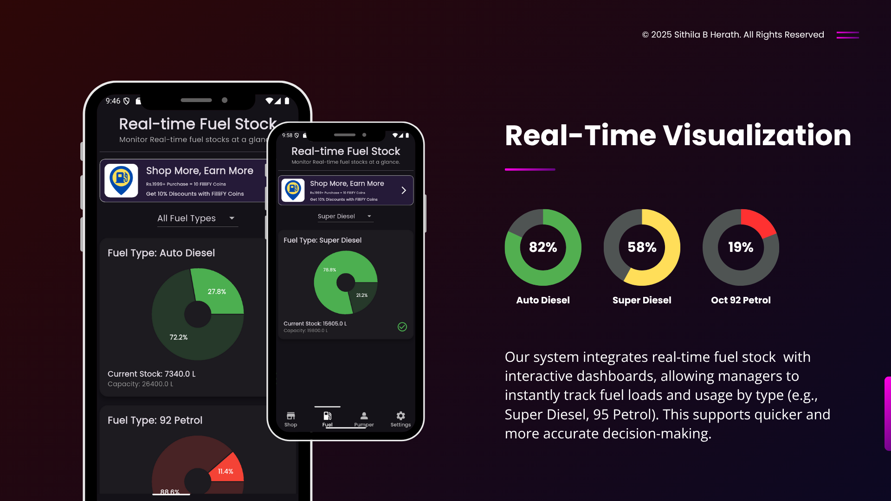
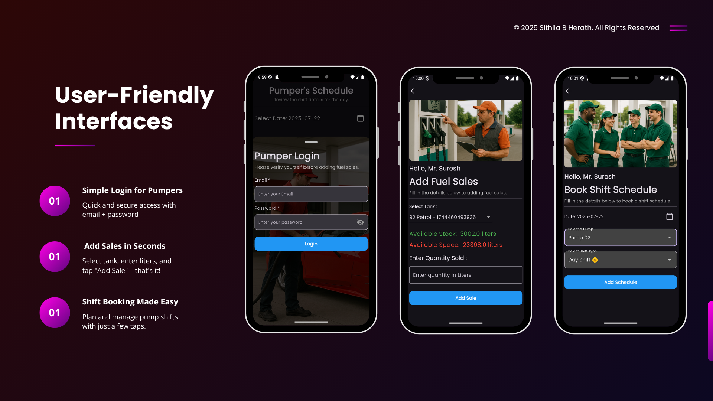

# 📱 FilliFy – Filling Station Management App

FilliFy is a smart and modern mobile application designed to streamline operations at fuel stations. From real-time fuel tracking to pumper shift management and online oil shop access — it's your all-in-one solution for efficient filling station management.



---

## ✨ Key Features

✅ **User-Specific Secure Logins**  
✅ **Real-Time Fuel Monitoring**  
✅ **Pumper Shift Management**  
✅ **Integrated Online Oil Shop**  
✅ **Dark Mode Interface**  
✅ **Downloadable Analytical Reports**

---

## 🛠 Tech Stack

- 💙 **Flutter 3.10** – Cross-platform mobile framework  
- 🔥 **Firebase Firestore** – Cloud database & real-time sync  

---

## 📸 Previews


---

---

---

---

---

## ⚙️ Installation Guide

To run the app locally, follow these steps:

```bash
# Clone the repository
git clone https://github.com/yourusername/fillify.git

# Navigate into the project directory
cd fillify

# Fetch project dependencies
flutter pub get

# Launch the app on emulator/device
flutter run
